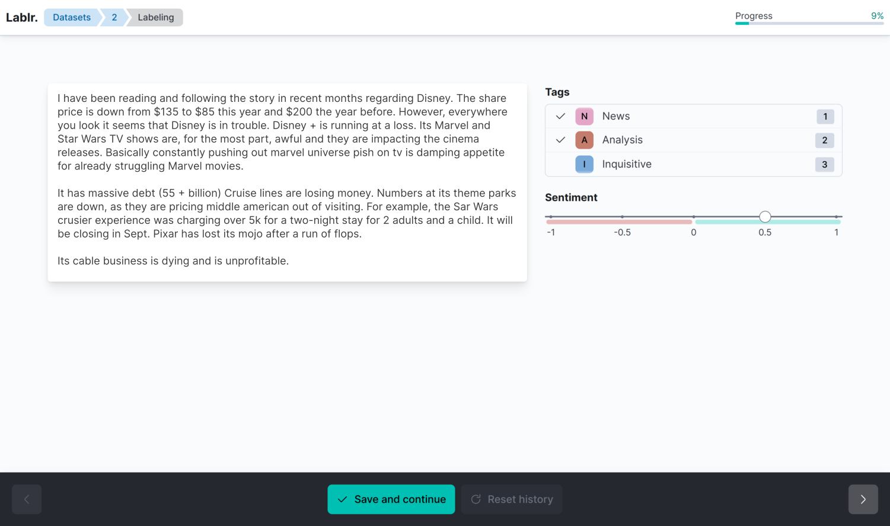

<div align="center">

# Lablr Annotation Tool


[](https://github.com/VarityPlatform/lablr/actions/workflows/test-python.yml)

_Lablr is an open source annotation tool designed for rapidly labeling text datasets for training supervised ML models_



</div>

## Overview

The tool's worfklow can be summarized with a few steps:

1. Define a dataset, its desired labels, and upload a CSV file containing the samples.
2. Begin labeling samples for a given dataset.
3. Export labels as another CSV file.

All of this is done with a clean, efficient UI.

### Current limitations

- Datasets are limited to text only
- Labels must be either boolean (classification) or numerical (regression)

## Getting started

To ensure a user can quickly begin the labeling process rather than wasting time configuring dependencies and installing the app, the tool is served in the form of a docker image.

### Prerequisites

The only prerequisites are `docker` and `docker-compose`.

- Instructions on installing `docker` can be found [here](https://docs.docker.com/get-docker/).
- Instructions on installing `docker-compose` can be found [here](https://docs.docker.com/compose/install/).

You can check for a valid installation with the `docker-compose --help` command.

### Running the application

The application state will be stored in the `~/.lablr` directory on the host machine. This directory will be bound to the docker image, so the state can be persisted when the image is shut down.

Start with:

```bash
# Pull the container if not already done
docker-compose pull

# Start the container
docker-compose up
```

The application should be running at [http://localhost:8000](http://localhost:8000).

## Development

The application is divided into two microservices: the frontend and backend.

For more information on developing the frontend, see the [frontend directory](./frontend).
For more information on developing the backend, see the [`backend` directory](./backend).

### Docker

To test the docker build, you can build a development image with `docker-compose build`.

### Makefile

The project includes a utility `Makefile` for running various helper commands. Run `make` to see a list of utility commands.

### Publish a new release

To cut a new release, simply use the following workflow:

```bash
# Optionally update the image tag used by the docker-compose.yaml file
# to cgundlach13/lablr:<sem_ver>
vim docker-compose.yaml
git add .
git commit -m "Updated image tag in docker-compose.yaml"

# Either on the master branch or in a feature branch run:
git tag v<sem_ver>

# Push the tag
git push origin $(git describe --tags --abbrev=0)
```

The images will automatically be built on dockerhub. You can check on the build process at the [dockerhub repository](https://hub.docker.com/repository/docker/cgundlach13/lablr).
